# Real-Time Telecom Network Event Pipeline

## Executive Summary

Telecom company collects real-time network event logs from thousands of cell towers across the country. This is a design proposal for a data pipeline that:

1. Ingests network event data in near real-time from cell towers
2. Cleans and validates data
3. Stores data optimized for querying 

### Event Schema
- `tower_id`: Cell tower identifier
- `timestamp`: Event timestamp
- `event_type`: Event classification (dropped_call, handover, congestion)
- `device_id`: Device identifier
- `signal_strength`: Signal strength in dBm
- `latitude`, `longitude`: Geographic coordinates

## Architecture Overview

**API gateway to ingest tower data using Cloud Run**
Towers may use multiple technilogy providers and require schema standadisation and validation. The gateway recieves the tower data 
and converts it into a standard format, whilst also enriching it with
tower metadata before sending it to pubsub.

- Auto-scales based on incoming request volume
- Native HTTPS endpoint simplifies tower integration
- deployed as custom service allowing flexibility and extensibility via custom python code
- Can do initial deduplication of events using composite key

**Message Queue to throttle message streaming using Pub/Sub (Kafka)**
Volume of data recieved likely to fluctuate. Pubsub handles 
the traffic by buffering the messages and streaming them to dataflow.

**Processing using Dataflow (Apache Beam)**
Dataflow allows the use of rich python libraries for customisable 
and extensible processing logic and horizontal auto scaling 
via parrallel workers.

- custom geo shapes
- Stateful processing enables deduplication across windows
- Stateful deduplication in Dataflow with windowing

**Anaytics optimised warehouse (OLAP) using BigQuery**
Processed data streamed to Bigquery for analytics. 

- Bigquery columnar storage ideal for analytics queries
- Clustering and partitioning allows for optimised querying
- Can extend to multiple fact and dimension tables as needed

**Storage using Google Cloud Storage (GCS)**
Raw events from API gateway are stored in GCS for long term storage.
Santized Pubsub ingestion events also sotred in GCS in case they need
to be reprocessed.

- GCS has low cost tiers for infrequently accessed data storage ideal
for data this is only accessed for audit and backup purposes.
- Pubsub does not offer long term storage, by pairing it with GCS can
achieve long term storage for audit and reprocessing.

**Orchestration using Cloud Composer (Airflow)**
Cloud composer for ochestration allows for DAG observability.
Airflow also offers rich features such as backfill and can be 
extended to trigger other services as needed on event.

**Validation**
Validating early at ingestion prevents processing costs for obviously invalid data. Routing invalid events to a separate Pub/Sub topic preserves them for audit and potential recovery. 

- Route Invalid events to Separate Pubsub topics, allows for them to be 
diagnosed and delt with in isolation.

### Testing Strategy

**CI/CD Integration:**
Test environment mirrors production with isolated resources (separate Pub/Sub topics, BigQuery datasets). Automated tests inject sample events and validate expected transformations.

**Test Scenarios:**
- Valid events flowing end-to-end
- Invalid data rejection and routing to DLQ
- Duplicate detection and removal
- High load handling with auto-scaling
- Failure recovery using Pub/Sub replay

**Infrastructure as Code:**
Terraform defines all GCP resources. Same code deploys dev, staging, and production environments, ensuring consistency.

```mermaid
graph TB
    %% Simplified Telecom Network Event Pipeline
    %% GCP-based real-time streaming data pipeline

    T["Cell Towers<br/>"]
    BQ_DW["BigQuery: Existing Datawarehouse<br/>Dimension & fact lookup"]
    CONSUMERS["Data Consumers<br/>Analysts & dashboards"]

    subgraph gcp["GCP Infrastructure"]
        CR["Cloud Run API Gateway<br/>Schema normalization & validation<br/><i>⚡ Auto-scales per request</i>"]
        PS_RAW["Pub/Sub: raw-events<br/><i>🛡️ Message durability & buffering</i>"]
        PS_INVALID["Pub/Sub: invalid-events"]
        DF["Dataflow (Apache Beam)<br/>Dedup, validate, geo-enrich<br/><i>⚡ Auto-scales workers</i>"]
        BQ_DATA["BigQuery: network_events<br/>Production data warehouse<br/><i>⚡ Partitioning and clustering</i>"]
        BQ_TEST["BigQuery: network_events_test<br/>Test data warehouse"]
        BQ_METRICS["BigQuery: pipeline_metrics<br/>Monitoring analytics"]
        GCS_INGESTION["GCS: Ingestion archive<br/>Long-term storage"]
        GCS_RAW["GCS: Raw events archive<br/><i>🛡️ Reprocessing capability</i>"]
        GCS_INVALID["GCS: Invalid events sink"]
        CM["Cloud Monitoring<br/>Metrics & alerts<br/><i>📊 Production monitoring</i>"]
        DASH["Monitoring Dashboard"]
    end

    %% ===== DATA FLOW =====
    T -->|HTTPS/mTLS| CR
    CR --> GCS_INGESTION
    CR -->|Valid| PS_RAW
    CR -->|Invalid| PS_INVALID
    PS_RAW --> DF
    PS_RAW --> GCS_RAW
    BQ_DW -->|Lookup| DF
    DF -->|Valid - Production| BQ_DATA
    DF -->|Valid - Test| BQ_TEST
    DF -->|Invalid| PS_INVALID
    PS_INVALID --> GCS_INVALID
    GCS_RAW -.->|Reprocess if needed| PS_RAW

    %% Monitoring flow
    CR & DF & BQ_DATA --> CM
    GCS_INVALID --> BQ_METRICS
    CM -->|Metric export| BQ_METRICS
    BQ_METRICS --> DASH

    %% Consumer flow
    BQ_DATA --> CONSUMERS

    %% ===== TESTING =====
    TEST_DATA["Test event samples<br/>GCS bucket"]
    CICD["<b>CI/CD TESTING (Cloud Build)</b><br/>• Inject test data → Cloud Run<br/>• Validate E2E pipeline<br/>• Assert expected results in BigQuery"]

    TEST_DATA -.-> CICD
    CICD -.-> CR
    CICD -.-> BQ_TEST

    %% ===== STYLING =====
    classDef gcp fill:#4285F4,stroke:#1967D2,color:#fff
    classDef storage fill:#34A853,stroke:#137333,color:#fff
    classDef monitoring fill:#FBBC04,stroke:#E37400,color:#000
    classDef consumer fill:#9AA0A6,stroke:#5F6368,color:#fff
    classDef callout fill:#FFF,stroke:#666,stroke-width:2px,color:#000

    class CR,DF,PS_RAW,PS_INVALID gcp
    class BQ_DATA,BQ_TEST,BQ_METRICS,BQ_DW,GCS_INGESTION,GCS_RAW,GCS_INVALID,TEST_DATA storage
    class CM,DASH monitoring
    class CONSUMERS consumer
    class CICD callout

```

